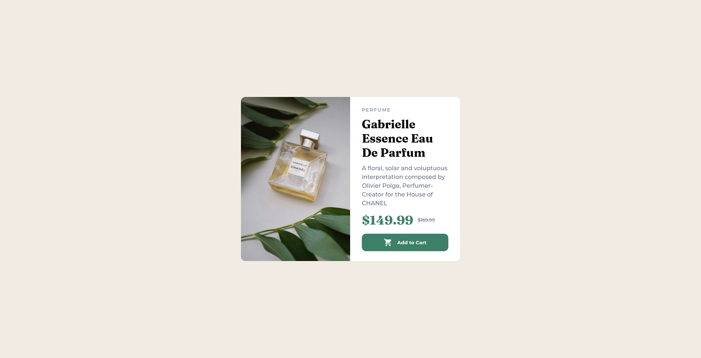

# Frontend Mentor - Product preview card component solution

This is a solution to the [Product preview card component challenge on Frontend Mentor](https://www.frontendmentor.io/challenges/product-preview-card-component-GO7UmttRfa). Frontend Mentor challenges help you improve your coding skills by building realistic projects.

## Table of contents

- [Overview](#overview)
  - [The challenge](#the-challenge)
  - [Screenshot](#screenshot)
  - [Links](#links)
- [My process](#my-process)
  - [Built with](#built-with)
  - [What I learned](#what-i-learned)
  - [Continued development](#continued-development)
  - [Author](#author)

## Overview

### The challenge

Users should be able to:

- View the optimal layout depending on their device's screen size
- See hover and focus states for interactive elements

### Screenshot

### Links

- Solution URL: [https://github.com/theadg/product-card-component]
- Live Site URL: [https://theadg.github.io/product-card-component/]

## My process

### Built with

- Semantic HTML5 markup
- CSS custom properties
- Flexbox
- Mobile-first workflow

### What I learned

I used SASS as a CSS preprocessor. I have learned and used custom css variables, media queries, and nesting. I have also incorporated proper naming of CSS classes. I can conclude that the Mobile-first Workflow is much better than going from Desktop to Mobile, also it's more productive.

### Continued development

I will be focusing more on using Semantic HTML tags and properly naming CSS Classes and Variables to have a more efficient workflow and experience.

## Author

- Frontend Mentor - [@theadg](https://www.frontendmentor.io/profile/theadg)
